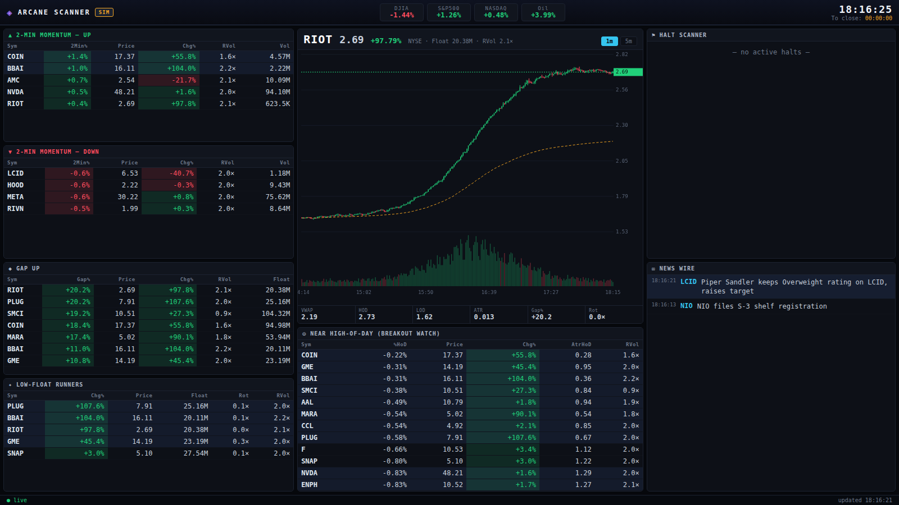

# 📈 Stock Scanner — Trade Ideas Dashboard

A real-time momentum **stock screener + trade-ideas dashboard** in the spirit of
Trade-Ideas / Warrior-style scanning terminals: multi-panel dark UI, live
scanners, candlestick charts, a news wire, and a halt monitor — all driven by a
pluggable data layer.



It runs **out of the box with no API keys**. When it can reach Yahoo Finance it
streams live market data; when it can't (offline, blocked network, weekend) it
transparently falls back to a built-in **market simulator** so the whole thing
is always populated and moving.

---

## What it does

**Scanners (recomputed every few seconds, pushed over a websocket):**

| Panel | Signal |
|---|---|
| **2-Min Momentum — Up / Down** | Short-window price thrust with real relative volume |
| **Gap Up** | Names gapped up vs. prior close (gap-and-go setups) |
| **Low-Float Runners** | Small-float names on the move — highest-squeeze setups |
| **Near High-of-Day** | Green names pinned within X% of the session high (breakout watch) |
| **Halt Scanner** | Currently halted names (LULD / news / regulatory) |
| **News Wire** | Latest headlines per symbol |

**Per-symbol analytics engine** computes the numbers momentum traders live on:
change %, gap %, **relative volume**, **VWAP** + distance, **ATR** & ATR-based
spreads, high/low of day, **float rotation**, and 2-minute momentum.

**Chart:** a self-contained canvas candlestick chart (1m / 5m) with VWAP line,
volume sub-panel, and last-price marker. Click any symbol in any table to load
it.

---

## Two ways to run it

**1. Instant / zero-install — `standalone.html`**
Just **double-click `standalone.html`** and it opens in your browser. No Python,
no terminal, no setup. It's a clean, minimal single-file dashboard that runs the
market **simulator** in the browser — perfect for a always-lively demo you can
open anywhere (or host as a link).

**2. Live market data — the Python app**
For real quotes from Yahoo Finance, run the full app below. Same scanners, with
live data.

---

## Quick start — the easy way (live data)

**Windows:** double-click **`Start-Windows.bat`**
**macOS:** double-click **`Start-Mac.command`**

That's it — it installs what it needs, starts the server, and opens the
dashboard in your browser automatically.

### Or from a terminal (any OS)

```bash
python start.py          # installs deps, launches, opens the browser
```

Force the always-lively offline demo (no internet needed):

```bash
# macOS / Linux
SCANNER_PROVIDER=simulated python start.py
# Windows PowerShell
$env:SCANNER_PROVIDER="simulated"; python start.py
```

The dashboard is served at **http://localhost:8000**. In the top-left, the tag
reads **LIVE** when it's pulling real market data and **SIM** when using the
simulator.

> **About the data:** live mode uses Yahoo Finance (no API key). It's real
> market data refreshed every ~15s. Yahoo's free intraday feed carries a small
> delay (it isn't tick-by-tick), and the scanners naturally look busiest
> **during US market hours** (9:30 AM–4:00 PM ET, weekdays). For true
> tick-level real-time you'd add a paid feed (Polygon/Finnhub) — the provider
> layer makes that a one-file change.

---

## Configuration

Everything tunable lives in [`config.py`](config.py) and can be overridden with
environment variables:

| Env var | Default | Meaning |
|---|---|---|
| `SCANNER_PROVIDER` | `auto` | `auto` \| `yahoo` \| `simulated` |
| `SCANNER_REFRESH` | `3` | Seconds between scan recomputes / pushes |
| `SCANNER_PORT` | `8000` | HTTP port |
| `SCANNER_MOMO_MIN_RVOL` | `1.5` | Min relative volume for momentum scans |
| `SCANNER_MOMO_MIN_2MIN` | `0.4` | Min 2-min % move for momentum scans |
| `SCANNER_GAP_MIN_PCT` | `3` | Min gap % for the Gap-Up scan |
| `SCANNER_LOW_FLOAT_MAX` | `50M` | Float ceiling for low-float runners |
| `SCANNER_SCAN_LIMIT` | `12` | Rows per scan table |

Edit `UNIVERSE` in `config.py` to change which tickers are watched.

---

## Architecture

```
config.py                     # universe, thresholds, provider selection
backend/
  models.py                   # Bar / Quote / NewsItem / Halt / Index
  providers/
    base.py                   # DataProvider interface
    yahoo.py                  # live yfinance provider (no key needed)
    simulated.py              # realistic offline market simulator
    factory.py                # auto-select w/ graceful fallback
  engine/
    metrics.py                # VWAP, ATR, RVol, HOD/LOD, float rotation, ...
    scanners.py               # the trade-idea scanners
  main.py                     # FastAPI: REST + /ws websocket, serves frontend
frontend/
  index.html / styles.css / app.js   # dark multi-panel terminal UI + canvas chart
```

**Data flow:** a background loop in `main.py` polls the active provider every
`SCANNER_REFRESH` seconds → `engine.metrics` computes a `Metrics` row per symbol
→ `engine.scanners` builds the ranked trade-idea lists → the snapshot is pushed
to every connected browser over `/ws`.

The provider interface is deliberately thin (`get_quotes`, `get_news`,
`get_indices`), so adding another data source (Polygon, Finnhub, IEX, a
broker feed, …) is just one new class.

### REST endpoints

| Endpoint | Returns |
|---|---|
| `GET /api/health` | provider + status |
| `GET /api/snapshot` | full current state (all scans, news, indices, halts) |
| `GET /api/scan/{name}` | one scanner's rows |
| `GET /api/quote/{symbol}` | full metrics for one symbol |
| `GET /api/bars/{symbol}?interval=1m\|5m` | session candles for the chart |
| `WS  /ws` | live snapshot stream |

---

## Live data notes

- The Yahoo provider uses [`yfinance`](https://github.com/ranaroussi/yfinance)
  and needs outbound access to Yahoo's endpoints. No key required.
- Yahoo has **no real-time halt feed**, so the Halt panel is only populated in
  simulator mode (or wire in a provider that has halts, e.g. Nasdaq/Polygon).
- **Not investment advice.** This is a screening/analysis tool and, in
  simulated mode, shows synthetic data for demonstration.
